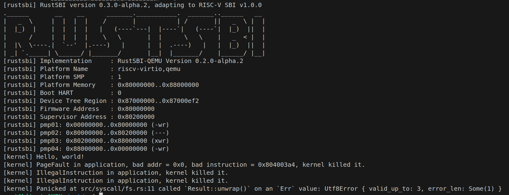

# ch3的报告

## 简单总结你实现的功能
- 首先在`src/trace.rs`文件中实现了一个全局静态结构体`TraceManager`。他的主要功能有:
    - 1. 维护一个数组,里面的元素是B树,数组的下标是appid。这里其实没有清零操作~。B树提供一个查找,系统调用的id为键,调用次数为值
    - 2. 在每次触发系统调用的时候都能被调用的方法`record_syscall`。
    - 3. 处理`trace`调用的方法current_task_syscall_count。

## 问答题

### 1. 正确进入 U 态后，程序的特征还应有：使用 S 态特权指令，访问 S 态寄存器后会报错。 请同学们可以自行测试这些内容（运行 三个 bad 测例 (ch2b_bad_*.rs) ）， 描述程序出错行为，同时注意注明你使用的 sbi 及其版本。
- 运行几个程序的输出


- 1. `ch2b_bad_address.rs`:
  - 这个程序试图向`(0x0 as *mut u8).write_volatile(0);`向0地址写东西是不被允许的
  - 执行到这一步的时候cpu试图访问0x0000,发现权限不够,直接抛出trap,设置`scause`,`stval`,`sepc`,然后我们的trap处理函数打印
    - `**[kernel] PageFault in application, bad addr = 0x0, bad instruction = 0x804003a4, kernel killed it.**`
- 2. `ch2b_bad_instructions.rs`
  - 这个程序试图使用指令`core::arch::asm!("sret");`.但是`sret`是内核级别的,所以cpu就trap了
  - `**[kernel] IllegalInstruction in application, kernel killed it.**`
- 3. `ch2b_bad_register.rs`
  - 问题在`core::arch::asm!("csrr {}, sstatus", out(reg) sstatus);`,csrr是内核特权级别的指令,应用程序执行cpu就trap了


### 2. 深入理解 trap.S 中两个函数 __alltraps 和 __restore 的作用，并回答如下问题:

1. L40：刚进入 __restore 时，sp 代表了什么值。请指出 __restore 的两种使用情景。
- 刚开始进入的时候sp的值是内核态的栈地址,也就是当前要恢复的 `TrapContext` 在内核栈上的位置。
- 使用场景1:处理完trap后，返回当前应用
- 使用场景2:第一次“切换到某个用户任务”的时候,因为我们的`TaskManagerInner`,对于每一个应用的初始化是`task.task_cx = TaskContext::goto_restore(init_app_cx(i));`
2. L43-L48：这几行汇编代码特殊处理了哪些寄存器？这些寄存器的的值对于进入用户态有何意义？请分别解释。

```s
ld t0, 32*8(sp)
ld t1, 33*8(sp)
ld t2, 2*8(sp)
csrw sstatus, t0
csrw sepc, t1
csrw sscratch, t2
```

- 处理了哪些寄存器?
  - `sstatus`:记录“之前是在哪个特权级运行的”,控制 sret 后用户态中断是否打开
  - `sepc`:恢复“返回时的指令地址”
  - `sscratch`:内核栈地址,之后再次trap需要记录这个

3. L50-L56：为何跳过了 x2 和 x4？
- x2是sp, sp 要分“内核栈的 sp”和“用户栈的 sp”两套来处理
- x4 = tp（thread pointer），通常用户态不使用这个

4. L60：该指令之后，sp 和 sscratch 中的值分别有什么意义？

- sp是用户态的栈地址,可以给用户程序使用,sscratch是内核的栈地址,下次trap的时候可以还原内核态

5. `__restore`：中发生状态切换在哪一条指令？为何该指令执行之后会进入用户态？

- 发生状态切换的是`sret`
- 因为执行`sret`的时候cpu会:
  - 从 CSR sstatus 里取出 SPP 位
  - 把当前特权级切回 SPP 指定的模式
  - 从 sepc 里取出要返回的 PC，跳到那条指令去执行
  - 同时根据 SPIE/SIE 等位，恢复中断使能状态


6. L13：该指令之后，sp 和 sscratch 中的值分别有什么意义？

```s
csrrw sp, sscratch, sp
```
- 这个是从用户态进入trap之前触发的函数
  - sp是用户态的栈指针,sscratch是之前保存的内核态的栈指针
  - 所以只是把sp和sscratch的值交换

7. 从 U 态进入 S 态是哪一条指令发生的？
- 是在`call trap_handler`发生的
    
## 荣誉准则

1. 在完成本次实验的过程（含此前学习的过程）中，我曾分别与 以下各位 就（与本次实验相关的）以下方面做过交流，还在代码中对应的位置以注释形式记录了具体的交流对象及内容：

> 我的操作系统老师刘国军

2. 此外，我也参考了 以下资料 ，还在代码中对应的位置以注释形式记录了具体的参考来源及内容：

> [linux0.00](https://github.com/rongwu/linux-0.00_)参考其中的思路,理解了用户态与内核态的跳转

3. 我独立完成了本次实验除以上方面之外的所有工作，包括代码与文档。 我清楚地知道，从以上方面获得的信息在一定程度上降低了实验难度，可能会影响起评分。

4. 我从未使用过他人的代码，不管是原封不动地复制，还是经过了某些等价转换。 我未曾也不会向他人（含此后各届同学）复制或公开我的实验代码，我有义务妥善保管好它们。 我提交至本实验的评测系统的代码，均无意于破坏或妨碍任何计算机系统的正常运转。 我清楚地知道，以上情况均为本课程纪律所禁止，若违反，对应的实验成绩将按“-100”分计。